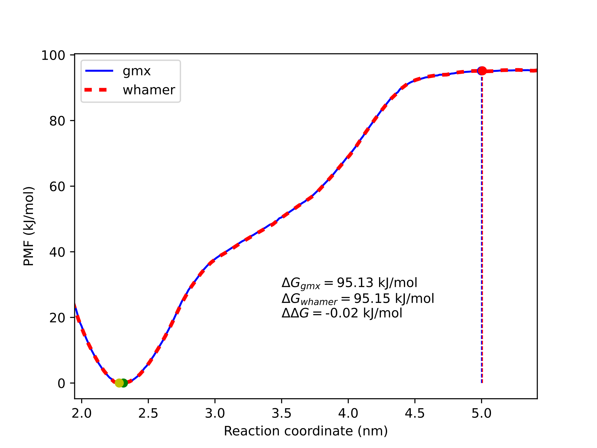

# whamer
Simple WHAM implementation in python.

whamer.py
 Contains the WHAM engine.
 Dependencies:
  - NumPy >= 1.21.6

compute_profile.py
 Script that can be executed from the command line. It uses whamer.py to compute the PMF and histograms, and saves both as XVG files.
 It can read the center of the potentials and force constants from Gromacs log files. Useful when you are working with different Gromacs versions.
 Dependencies:
  - NumPy >= 1.21.6
  - SciPy >= 1.7.3
  Use:
   The easiest way to use it is:
   `python compute_profile.py --log log-files.dat --pullx pullx-files.dat`
   log-files.dat and pullx-files.dat have the path to Gromacs log and pullx.xvg files as usually done to run gmx wham.

The resulting profiles are completely equivalent to those produced by gmx wham.

References:
 - Kumar, et al. J. Comp. Chem. 1992. 13(8), 1011-1021. https://doi.org/10.1002/jcc.540130812
 - Shell, et al. Methods Based on Probability Distributions and Histograms. https://doi.org/10.1007/978-3-540-38448-9_3